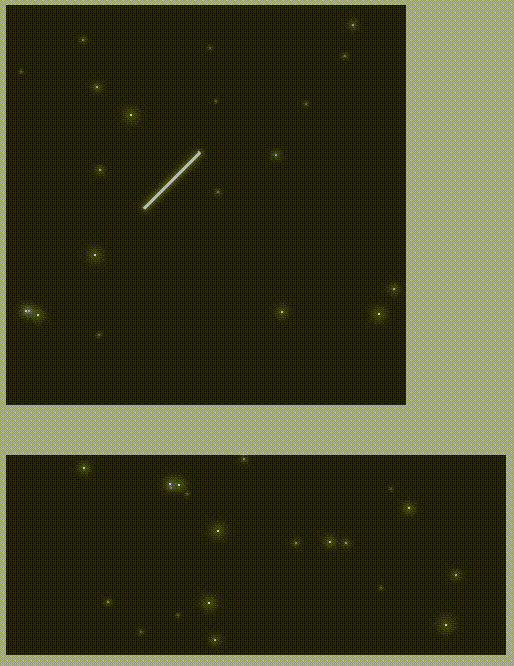

# HTML Shooting Star Effect



<hr>
This project offer you a function that apply effect like shooting star in the dark sky to any element you want.

## Installation

That's simple. Insert a script tag in the `head` tag like below then you can apply the shooting star effect.

```html
<head>
  ...
  <script src="https://cdn.jsdelivr.net/gh/bvv8808/shootingstar-html@1.0.0/shootingstar.js"></script>
</head>
```

If you use npm, you can install by the follow command.

```shell
npm i @hyeonwoo/shootingstar-html
```

## Usage

Get a element that you want to apply the shooting star effect.

```html
...
<body>
  ...
  <div id="nightSky"></div>
</body>
...
```

```javascript
const nightSky = document.querySelector("#nightSky");
const shootingStar = new ShootingStar(nightSky);

// ***** If you use npm and installed this via npm, create ShootingStar object by the following code.
import ShootingStar from "@hyeonwoo/shootingstar-html";
const shootingStar = new ShootingStar(nithgSky);

// ***** If you are also use typescript
import ShootingStar, { IShootingStar } from "@hyeonwoo/shootingstar-html";
const shootingStar: IShootingStar = new ShootingStar(nithgSky);
```

## Usage with options

```javascript
const options = {
  // default options
  starLength: 80,
  starColor: "#ccccff",
  distance: 120,
  shootingDuration: 600,
  frequency: 1500,
  minFrequency: 500,
  playWhenCreated: true,
  showBackgroundStars: true,
  numberOfBackgroundStars: 20,
};
const shootingStar = new ShootingStar(nightSky, options);

// ***** If you use npm and installed this via npm, create ShootingStar object by the following code.
import ShootingStar from "@hyeonwoo/shootingstar-html";
const shootingStar = new ShootingStar(nithgSky, options);

// ***** If you are also use typescript
import ShootingStar, { IShootingStar, IOptions } from "@hyeonwoo/shootingstar-html";
const shootingStar:IShootingStar = new ShootingStar(nithgSky, {/*Your own options*/} as IOptions);
```

## Options

| name                    | type    | default | description                                                                                                                                                       |
| ----------------------- | ------- | ------- | ----------------------------------------------------------------------------------------------------------------------------------------------------------------- |
| starLength              | number  | 40      | How long the star's size is. `px`.                                                                                                                                |
| starColor               | string  | "#fff"  | The color of star                                                                                                                                                 |
| distance                | number  | 120     | How far the star moves. `px`                                                                                                                                      |
| shootingDuration        | number  | 600     | How fast the star falls down. `ms`                                                                                                                                |
| frequency               | number  | 1500    | Stars will appear at a random timing (0 ms ~ `frequency`ms). If you want to stars that appear in the same frequency, set `minFrequency` and `frequency` the same. |
| minFrequency            | number  | 300     | To control the timing that stars appear. `ms`                                                                                                                     |
| playWhenCreated         | boolean | true    | When you create a ShootingStar object, the effect is automatically starts. If you don't want that, set 'false'                                                    |
| showBackgroundStars     | boolean | true    | Render various stars when the ShootingStar object created. If you don't want to redner them, set 'false'                                                          |
| numberOfBackgroundStars | number  | 20      | How many backgroundStars render                                                                                                                                   |

## Methods

### getCurrentOption(parameter)

To get current options of a ShootingStar object.  
`parameter`: single string or array of option keys

```javascript
const s1 = new ShootingStar(target);
console.log(s1.getCurrentOption("starLength")); // --> 40
console.log(s1.getCurrentOption(["starLength", "distance"])); // --> [40, 120]
```

### setStarLength(newStarLength)

To set the length of star you want.  
`newStarLength`: only number

```javascript
const s1 = new ShootingStar(target);
s1.setStarLength(30);
console.log(s1.getCurrentOption("starLength")); // --> 30
```

### setStarColor(newStarColor)

To set the length of star you want.  
`newStarColor`: only string. "#abcabc", "rgb(...)", "yellow"

```javascript
const s1 = new ShootingStar(target);
s1.setStarColor("#f3f3f3");
console.log(s1.getCurrentOption("starColor")); // --> "#f3f3f3"
```

### setDistance(newDistance)

To set the length of star you want.  
`newDistance`: only number

```javascript
const s1 = new ShootingStar(target);
s1.setDistance(100);
console.log(s1.getCurrentOption("distance")); // --> 30
```

#### setShootingDuration

#### setFrequency

#### setMinFrequency

#### setNumberOfBcakgroundStars

- The same usage with above methods. the number of parameter is only one (the new value).
  <br>
  <br>

### stop()

To stop shooting star effect.

### play()

To play shooting star effect.

### showBackgroundStars()

Show various stars on the background of the target.

### hideBackgroundStars()

Hide various stars on the background of the target.

## Thank you
